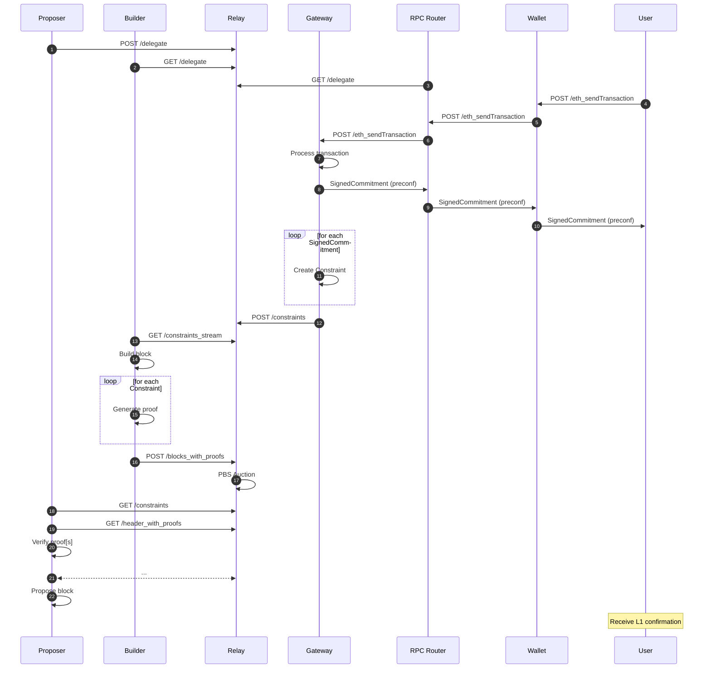

# Preconfirmations API Specification

This was developed during sequencing week in collaboration with Ethereum Foundation by the following teams. This is the standard shared by any and all teams offering preconfirmations on Ethereum Mainnet. 

## Abstract

A proposed generic API specification to support Ethereum and Layer 2 preconfirmations. The API extends the existing PBS architecture and [builder-specs](https://github.com/ethereum/builder-specs). This specification allows proposers to offer preconfirmations to users either directly or by delegating the privilege to a Gateway.

## Motivation

Ethereum’s 12 second block time may be restrictive for particular use cases and is especially inhibitive for L2s that rely on fast confirmations. One option is to reduce the block time. However, this is a very large lift and would likely require multiple hard forks. This alternative option extends the existing PBS architecture, which allows proposers or constraint delegates (Gateways) to offer transaction preconfirmations to users.


## API Scope

**In Scope**

- the delegation from proposers to gateways
- the submission of constraints
- the retrieval of constraints

Also known as the Constraints API

**Out of Scope**
- Any interaction between thrid parties (Users, RPC Router, etc) and the Gatway.
- Commitments from Gateways to third parties

Also known as the Commitments API

# Terminology

| Term           | Description                                                                                                                                    |
|----------------|------------------------------------------------------------------------------------------------------------------------------------------------|
| Preconfer      | A proposer who registers to offer preconfirmations is a preconfer. Any party the proposer delegates preconf authority to is also a preconfer.  |
| Gateway        | A party which has been delegated preconf constraint and commitment submission authority by the proposer.                                       |
| Builder        | A party specialized in constructing execution payloads and proving constraints are followed.                                                   |
| Relay          | A trusted party that facilitates the exchange of execution payloads between Builders and Proposers and validating constraints are followed.    |
| RPC Router     | The component that provides an abstracted EVM RPC API endpoint for users to submit L2 transactions and get preconfirmations.                   |


# API Summary

| **Namespace** | **Method** | **Endpoint** | **Description** |
| --- | --- | --- | --- |
| `constraints`   | `POST` | [/constraints/v0/relay/delegate](./preconf-api.md#endpoint-constraintsv0relaydelegate)           | Endpoint for Proposer to delegate preconfirmation rights, or more accurately, constraint submission rights to a Gateway. |
| `constraints`   | `GET` | [/constraints/v0/relay/delegations](./preconf-api.md#endpoint-constraintsv0relaydelegationsslotslot)         | Endpoint to retrieve the signed delegations for the proposer of a given slot, if it exists. |
| `constraints`   | `POST` | [/constraints/v0/relay/constraints](./preconf-api.md#endpoint-constraintsv0relayconstraints)        | Endpoint for Proposer or Gateway to submit a batch of signed constraints to the Relay. |
| `constraints`   | `GET` | [/constraints/v0/relay/constraints](./preconf-api.md#endpoint-constraintsv0relayconstraintsslotslot)         | Endpoint to retrieve the signed constraints for a given slot. |
| `constraints`   | `GET` | [/constraints/v0/relay/constraints_stream](./preconf-api.md#endpoint-constraintsv0relayconstraints_streamslotslot)  | Endpoint to retrieve an SSE stream of signed constraints. |
| `constraints`   | `POST` | [/constraints/v0/relay/blocks_with_proofs](./preconf-api.md#endpoint-constraintsv0relayblocks_with_proofscancellationscancellations) | Endpoint for Builder to submit a block with proofs of constraint validity to the Relay. |
| `constraints`   | `GET` | [/constraints/v0/relay/header_with_proofs](./preconf-api.md#endpoint-constraintsv0relayheader_with_proofsslotparent_hashpubkey)  | Endpoint for Proposer to request a builder bid with proof of constraint validity. |

---

---

# Constraints API Endpoints

### Endpoint: `/constraints/v0/relay/delegate`

Endpoint for a Proposer to delegate constraint submission rights to a Gateway. 

- **Method:** `POST`
- **Response:** Empty
- **Headers:**
    - `Content-Type: application/json`
- **Body:** JSON object of type `SignedDelegation`

- **Schema**
    ```python
    # A signed delegation
    class SignedDelegation(Container):
        message: Delegation
        signature: BLSSignature

    # A delegation from a proposer to a BLS public key
    class Delegation(Container):
        proposer: BLSPubkey
        delegate: BLSPubkey 
        slasher: Address
        valid_until: Slot
        metadata: Bytes
    ```

- **Description**
    
    A proposer can delegate preconfirmations rights by signing a `Delegate` message with their `proposer` BLS private key. A `SignedDelegation` binds the `proposer` public key to the `delegate` public key and a `slasher` contract until after the `valid_until` slot elapses. During this time, the `delegate` can submit constraints to the relay on behalf of the `proposer`.

    - `proposer`: The BLS public key of the proposer who is delegating preconfirmation rights.
    - `delegate`: The BLS public key of the gateway who is receiving preconfirmation rights.
    - `slasher`: The address of a slasher contract containing a slashing function to penalize a proposer who has violated constraints (i.e., reneged on a preconf).
    - `valid_until`: slot number (inclusive) that a `SignedDelegation` is considered valid until
    - `metadata`: Additional opaque byte array reserved for and interpreted by the slashing function and/or the gateway (e.g., gas limit, blob limit, chain id, preconf type)

    While the Constraints API aims to be unopinionated about how slasher contracts are implemented, it's assumed that `SignedDelegation` messages are part of the evidence used to slash a proposer.
---

### Endpoint: `/constraints/v0/relay/delegations?slot={slot}`

Return the active delegations for the proposer of this slot, if they exist.

- **Method:** `GET`
- **Response:** `SignedDelegation[]`
- **Parameters:**
    - `slot`: `string` (regex `[0-9]+`)
- **Body:** Empty

- **Example Response**
    ```json
    [
        {
            "message": {
                "proposer": "0x93247f2209abcacf57b75a51dafae777f9dd38bc7053d1af526f220a7489a6d3a2753e5f3e8b1cfe39b56f43611df74a",
                "delegate": "0x84e47f2209abcacf57b75a51dafae777f9dd38bc7053d1af526f220a7489a6d3a2753e5f3e8b1cfe39b56f43611df74b",
                "slasher": "0xabcf8e0d4e9587369b2301d0790347320302cc09",
                "valid_until": "12345",
                "metadata": "0xe9587369b2301d0790347320302cc069b2301d0790347320302cc0943d5a1884560367e8208d920f2e9587369b2301de9587369b2301d0790347320302cc0"
            },
            "signature": "0x1b66ac1fb663c9bc59509846d6ec05345bd908eda73e670af888da41af171505cc411d61252fb6cb3fa0017b679f8bb2305b26a285fa2737f175668d0dff91cc1b66ac1fb663c9bc59509846d6ec05345bd908eda73e670af888da41af171505"
        }
    ]
    ```

- **Description**

    The Relay should only return signed delegations that were signed by the proposer.

---

### Endpoint: `/constraints/v0/relay/constraints`

Endpoint for submitting a batch of constraints to the relay. The constraints are expected to be signed by a `delegate` BLS private key, whose corresponding public key is specified in a `SignedDelegation` message.

- **Method:** `POST`
- **Response:** Empty
- **Headers:**
    - `Content-Type: application/json`
- **Body:** JSON object of type `SignedConstraints[]`

- **Schema**

    ```python
    # A signed "bundle" of constraints.
    class SignedConstraints(Container):
        message: ConstraintsMessage
        signature: BLSSignature

    # A "bundle" of constraints for a specific slot.
    class ConstraintsMessage(Container):
        delegate: BLSPubkey
        slot: uint64
        contraints: List[Constraint]

    # A contraint for a transactions
    class Constraint(Container):
        commitmentType: uint64
        payload: Bytes
    ```

- **Description**
    
    For each `Preconfirmation` the delegate signs, they will need to create a matching `Constraint`. Collectively, a `SignedConstraints` message is posted to the relay. 
    
    - `commitmentType`: unsigned 64-bit number between `0` and `0xffffffffffffffff` that represents the type of the proposer commitment
    - `payload`: opaque byte array whose interpretation is dependent on the `commitmentType`

    Particularly each `commitmentType` would have a corresponding spec that defines:
    - a schema for a `Preconfirmation` and `SignedPreconfirmation` message
    - how a `Constraint.payload` is interpreted
    - how a `Constraint.payload` is created given a `SignedPreconfirmation`
    - the ordering of `constraints[]`
    - how to build a valid block given a `ConstraintsMessage`
    - how to generate proofs of constraint validity
    - how to verify proofs of constraint validity
---

### Endpoint: `/constraints/v0/relay/constraints?slot={slot}`

Returns all signed constraints for a given slot, if they exist.

- **Method:** `GET`
- **Response:** `SignedConstraints[]`
- **Parameters:**
    - `slot`: `string` (regex `[0-9]+`)
- **Body:** Empty

- **Example Response**
    ```json
    [
        {
            "message": {
                "delegate": "0x93247f2209abcacf57b75a51dafae777f9dd38bc7053d1af526f220a7489a6d3a2753e5f3e8b1cfe39b56f43611df74a",
                "slot": "12345",
                "constraints": [
                    {
                        "commitmentType": "0x00",
                        "payload": "0x301d0790347320302cc0943d5a1884560367e8208d920f2e9587369b2301de9587369b2301d0790347320302cc0"
                    },
                    {
                        "commitmentType": "0x01",
                        "payload": "0x367e8208d920f2e9587369b2301de9587369b2301d0790347320302cc0301d0790347320302cc0943d5a1884560367e8208d920f2e958"
                    }
                ]
            },
            "signature": "0x1b66ac1fb663c9bc59509846d6ec05345bd908eda73e670af888da41af171505cc411d61252fb6cb3fa0017b679f8bb2305b26a285fa2737f175668d0dff91cc1b66ac1fb663c9bc59509846d6ec05345bd908eda73e670af888da41af171505"
        }
    ]
    ```

- **Description**

    The Relay should only return signed constraints that were signed by the proposer or a gateway that was delegated to by the proposer.

---

### Endpoint: `/constraints/v0/relay/constraints_stream?slot={slot}`

Returns a stream of constraints via Server-Sent Events (SSE).

- **Method:** `GET`
- **Response:**  Server-sent events containing `SignedConstraints[]` objects
- **Parameters:**
    - `slot`: `string` (regex `[0-9]+`)
- **Body:** Empty
- **Headers**:
    - `Content-Type: text/event-stream`
    - `Cache-Control: no-cache`
    - `Connection: keep-alive`

- **Example Response**
    ```json
    event: json
    data: [
        {
            "message": {
                "delegate": "0x93247f2209abcacf57b75a51dafae777f9dd38bc7053d1af526f220a7489a6d3a2753e5f3e8b1cfe39b56f43611df74a",
                "slot": "12345",
                "constraints": [
                    {
                        "commitmentType": "0x00",
                        "payload": "0x301d0790347320302cc0943d5a1884560367e8208d920f2e9587369b2301de9587369b2301d0790347320302cc0"
                    },
                    {
                        "commitmentType": "0x01",
                        "payload": "0x367e8208d920f2e9587369b2301de9587369b2301d0790347320302cc0301d0790347320302cc0943d5a1884560367e8208d920f2e958"
                    }
                ]
            },
            "signature": "0x1b66ac1fb663c9bc59509846d6ec05345bd908eda73e670af888da41af171505cc411d61252fb6cb3fa0017b679f8bb2305b26a285fa2737f175668d0dff91cc1b66ac1fb663c9bc59509846d6ec05345bd908eda73e670af888da41af171505"
        }
    ]

    ```
- **Description**

    This endpoint is a streaming endpoint meant to reduce round-trip latency via SSE, allowing Relays to push new constraints to Builders in realtime.
    The Relay should only return signed constraints that were signed by the proposer or a gateway that was delegated to by the proposer. 
---

### Endpoint: `/constraints/v0/relay/blocks_with_proofs?cancellations={cancellations}`

Endpoint for submitting blocks with proofs of constraint validity to a Relay.

- **Method:** `POST`
- **Parameters:**
    - `cancellations`: `bool` (query)
- **Headers:**
    - `Content-Type: application/json`
- **Body:** JSON object of type `VersionedSubmitBlockRequestWithProofs`
- **Response:** Empty

- **Schema**
    ```python
    class VersionedSubmitBlockRequestWithProofs:
        ... # All regular fields from VersionedSubmitBlockRequest, additionally
        proofs: ConstraintProofs

    class ConstraintProofs(Container):
        commitmentTypes: List[uint64, MAX_CONSTRAINTS_PER_SLOT]
        payloads: List[Bytes, MAX_CONSTRAINTS_PER_SLOT]
    ```

- **Description**
    
    The `VersionedSubmitBlockRequestWithProofs` schema extends `VersionedSubmitBlockRequest` from the [original relay specs](https://flashbots.github.io/relay-specs/#/Builder/submitBlock) to include proofs of constraint validity. A Builder can protect their block's content while proving that the block satisfies the constraints by including proofs in the `VersionedSubmitBlockRequestWithProofs` message. To support a wide range of constraint types with different proving requirements, `ConstraintProofs` is left open-ended to allow for future flexibility.

    - `commitmentTypes`: list of unsigned 64-bit numbers between `0` and `0xffffffffffffffff` that represents the type of the proposer commitment (not required to be homogenous)
    - `payloads`: list of opaque byte arrays whose interpretation is dependent on the `commitmentTypes`
    - if `cancellations` is true, the Builder is signaling to opt into bid cancellations

- **Requirements**: 
    - each `commitmentType` has a spec that defines how builders can generate `proofs` for their block
    - each `commitmentType` has a spec that defines how relays and proposers can verify `proofs`
    - The length of `commitmentTypes` and `payloads` must be the same

- **Example Payload**
    ```json
    {
    "message": {
        "slot": "102",
        "parent_hash": "0x65b83b421bce1cd05bce2d86eb3233122c150e790770a0083e767a137bb5a2ed",
        "block_hash": "0xd1f43eacf8061a694b2bbe0798b1e50b99084cfdf136ba1fd5ec020f14271010",
        "builder_pubkey": "0xaa1488eae4b06a1fff840a2b6db167afc520758dc2c8af0dfb57037954df3431b747e2f900fe8805f05d635e9a29717b",
        "proposer_pubkey": "0xae5302796cfeca685eaf37ffd5baeb32121f2f07415bee26cc0051ee513ff3932d2c365e3d9f87b0949a5980445cb64c",
        "proposer_fee_recipient": "0x8943545177806ED17B9F23F0a21ee5948eCaa776",
        "gas_limit": "27616981",
        "gas_used": "295536",
        "value": "418266798562488"
    },
    "execution_payload": {
        "parent_hash": "0x65b83b421bce1cd05bce2d86eb3233122c150e790770a0083e767a137bb5a2ed",
        "fee_recipient": "0x8943545177806ED17B9F23F0a21ee5948eCaa776",
        "state_root": "0x41a8bd9993a0efd49767892963cb30ea9695fc7ccab1f3deee417aa269a92f77",
        "receipts_root": "0x37677efb710ba86196a244c77746aff51c1c9f73c86d233485b8052d94716022",
        "logs_bloom": "0x00000000000000000000000000000000000000000000000000000000000000000000000000000000000000000000000000000000000000000000000000000000000000000000000000000000000000000000000000000000000000000000000000000000000000000000000000000000000000000000000000000000000000000000000000000000000000000000000000000000000000000000000000000000000000000000000000000000000000000000000000000000000000000000000000000000000000000000000000000000000000000000000000000000000000000000000000000000000000000000000000000000000000000000000000000000",
        "prev_randao": "0x77a34ab437d022f25433b37fc311c4115c4f691c5737caf93779b70a0e4d4c95",
        "block_number": "102",
        "gas_limit": "27616981",
        "gas_used": "295536",
        "timestamp": "1731939746",
        "extra_data": "0x496c6c756d696e61746520446d6f63726174697a6520447374726962757465",
        "base_fee_per_gas": "1882",
        "block_hash": "0xd1f43eacf8061a694b2bbe0798b1e50b99084cfdf136ba1fd5ec020f14271010",
        "transactions": [
        "0xf86f820154845acf6ba0825208946177843db3138ae69679a54b95cf345ed759450d87071afd498d0000808360306ca0210d69b34df72b8067d2e57961d525a5a8856ef9e8d16be96852db57bdc6aeada04dc401eeb7801b1f6b9efe1d843189bbfdca1acf8802810cee1d703f2649a50b",
        "0xf86f820155845acf6ba082520894687704db07e902e9a8b3754031d168d46e3d586e87071afd498d0000808360306ba0f11e0e52e772e58b1ad64aa919293e735a936a2b414677599b83b815053b42afa041894c134e87cdb095be478c170ea9442eb312d3505524ff478194fd29ac723d",
        "0xf86f820156845acf6ba08252089415e6a5a2e131dd5467fa1ff3acd104f45ee5940b87071afd498d0000808360306ca04bd1b80b7c1f4c2510247f42f7342c5291c67a15109f8d4e7cc73bf929e53cf2a060bb7a9994cd2a70794db653d801f56d33408b4dca456cf62d80325718ad43e0",
        "0xf86f820157845acf6ba08252089480c4c7125967139acaa931ee984a9db4100e0f3b87071afd498d0000808360306ba0dfb605c47f84cd9b0c4f90f39308e10e00bfaff38d4905ee211f51f3389cc272a021f37a9064ba4b98431a8c614c6f2ab02c8d6ffd2d4c6d896405cdac1386ed66",
        "0xf86f820158845acf6ba082520894d08a63244fcd28b0aec5075052cdce31ba04fead87071afd498d0000808360306ca05b046b8ff98792bde534233dea5f15cfe24d37963e77da9379813c4ced89dab6a007c2bd7de299aba36c60651c29302868ac94dcb4064db1cee96c6381da4ead7f",
        "0xf86f820159845acf6ba0825208940b06ef8be65fcda88f2dbae5813480f997ee8e3587071afd498d0000808360306ba09a1850c2f6080f662f983dcab161a83290a2b98792401e40d8bea15838cfce22a007e0cb2ae9b0057071820677783e4a2f7a04aeeb8faab7981b434ad1d9a24e5f",
        "0xf86f82015a845acf6ba0825208941cb96c5809da5977f99f69c11ee58bae5711c5f187071afd498d0000808360306ba071f5330b3d38b57e1c24dbbe82a86387d2310043a669fc5d7492dd88c192df02a05d78693952297460ccc4c8beaf3ec9b99653571d6539e5bcadbf7921e1f8728d",
        "0xf86f82015b845acf6ba0825208942aa48ee899410a6d97c01b0bb0eeaf1771cc435b87071afd498d0000808360306ca0d35d384046f37f9d1da5400df25b930a1692ca2a3a15684b973fdbd40cf34f4fa02906f6122f69991a2ca8b4edba5efc3f3982a85540182101985ce8e292ddbfff",
        "0xf86f82015c845acf6ba08252089407b9d920dd8e8d83dc1125c94fc0b3cdcdf602fb87071afd498d0000808360306ba0f85ab12940b7c5057958a090b9f3bac0a6a7cbcba5c93e818f14d6e24938bcfea0476cc76f82d36da2b2a77d0e520de992dd737508f54c2e710f68c45d6905d962",
        "0xf86f82015d845acf6ba082520894fcb6e353ad4f79245c7cb704abcffe2f4868424187071afd498d0000808360306ca0a50e3fe9877e524676ce519f34e7917f72ef6da9ca075ed65130eb7b828875f0a03764f3dfbf7e656e818dab076b31f223fd2486c275452e283f5e2d062b2e8b67",
        "0x02f8908330182480845acf6267845acf75718254ae94614561d2d143621e126e87831aef287678b442b8830186a0a0c20e0240904510085d38aa992039f3ec5a3bb57f7ede6f8924f86c810d261270c001a0993040420b9f88e6e94654d3d4bba64dfd942356d932137682a9ee9b68c08e1aa017127aa42b78c91c57de1dbb5b2852923977bc22c60ffc3e64796885311be88b",
        "0x02f8908330182401845acf6267845acf75718254ae94614561d2d143621e126e87831aef287678b442b8830186a0a006f8188796440f23e951c43dabc12708faf18f8e8f84417d1333945b86894cc3c001a0edf40236b9cdfbb25cda8810484340e9d5b1e1023922b37b1d483a5d1fb3f130a00c9ce488f82ce829caafa5c97e187a657f49414360307076bec56de53aabb918",
        "0x02f8908330182402845acf6267845acf75718254ae94614561d2d143621e126e87831aef287678b442b8830186a0a09498dae671e12a4df22225c07db38b1b6c4bf4207b9e49fb10062918fb9d4d8fc001a0a8038bf97cc0f7bc742b7b319b4d98154300eb941746f53c48362c55df1913d6a0728550ffc7c06da44f2d6d356285bc24236eac6628a879d5072321eb73d071e4",
        "0x02f86e83301824068082075a825208948943545177806ed17b9f23f0a21ee5948ecaa77687017c6953f31cb880c001a0462fb6848c16e585b786e4fc168bd20a3cb180ebf00e34b93fed9c42b0df0e76a03ac159e02cee545d3e24be5fbd26f902626e18bcf6626f50a7636d4de28834e7"
        ],
        "withdrawals": [],
        "blob_gas_used": "0",
        "excess_blob_gas": "0"
    },
    "signature": "0x86ee27935ac26ea3f6f8ed0f5bf44500809628cbe003dba4867462481d6a7ea97e13b41220b30181a38d3aeebde61de50e166e05968b03666e2708da3f8311e14848c58c0003b5e6eedc2e6de0dfe6fedbe15fe676bcd6ec867ff60a712b7166",
    "proofs": {
        "commitmentTypes": [0x00, 0x00],
        "payloads": ["0x5097...", "0x932587..."]
    },
    "blobs_bundle": { "commitments": [], "proofs": [], "blobs": [] }
    }
    ```
---    

### Endpoint: **`/constraints/v0/relay/header_with_proofs/{slot}/{parent_hash}/{pubkey}`**

Endpoint for requesting a builder bid with constraint proofs from a Relay.

- **Method:** `GET`
- **Response:** `VersionedSignedBuilderBidWithProofs`
- **Parameters:**
    - `slot`: `string` (regex `[0-9]+`)
    - `parent_hash`: `string` (regex `0x[a-fA-F0-9]+`)
    - `pubkey`: `string` (regex `0x[a-fA-F0-9]+`)
- **Body:** Empty

- **Schema**
    ```python
    class VersionedSignedBuilderBidWithProofs:
        ... # All regular fields from VersionedSignedBuilderBid, additionally
        proofs: ConstraintProofs

    class ConstraintProofs(Container):
        commitmentTypes: List[uint64, MAX_CONSTRAINTS_PER_SLOT]
        payloads: List[Bytes, MAX_CONSTRAINTS_PER_SLOT]
    ```

- **Description**
    
    The `VersionedSignedBuilderBidWithProofs` schema extends `VersionedSignedBuilderBid` from the [original builder specs](https://ethereum.github.io/builder-specs/#/Builder/getHeader) to include proofs of constraint validity. Without leaking the block's contents, a Proposer can verify that the block satisfies the constraints by checking the `proofs` against the block header. To support a wide range of constraint types with different proving requirements, `ConstraintProofs` is left open-ended to allow for future flexibility.

    - `commitmentTypes`: list of unsigned 64-bit numbers between `0` and `0xffffffffffffffff` that represents the type of the proposer commitment (not required to be homogenous)
    - `payloads`: list of opaque byte arrays whose interpretation is dependent on the `commitmentTypes`

- **Requirements**: 
    - each `commitmentType` has a spec that defines how builders can generate `proofs` for their block
    - each `commitmentType` has a spec that defines how relays and proposers can verify `proofs`
    - When serializing, the `proofs` field must be present in `data`, at the same level of `signature` and `message`. See the example below.
    - The length of `commitmentTypes` and `payloads` must be the same

- **Example Payload**
    ```python
    # commitmentType = 0x00
    class InclusionProof(Container):
        tx_hash: Bytes32
        index: uint64
        merkle_hashes: List[Bytes32]
    
    # example inclusion proofs
    proof_0 = InclusionProof(
        tx_hash="0xcf8e...", index=7, merkle_hashes=["0xa7bc...", "0xd912...", ...]
    ).ssz_encode()

    proof_1 = InclusionProof(
        tx_hash="0x9fbb...", index=9, merkle_hashes=["0xeeab...", "0x1a2c...", ...]
    ).ssz_encode()

    # example envelope for mulitple proofs
    proofs = ConstraintProofs(
        commitmentTypes=[0x00, 0x00],
        payloads=[
            proof_0,
            proof_1,
        ],
    )
    ```

- **Example Response**
    ```json
    {
        "version": "deneb",
        "data": {
            "message": {
                "header": {
                    "parent_hash": "0xcf8e0d4e9587369b2301d0790347320302cc0943d5a1884560367e8208d920f2",
                    "fee_recipient": "0xabcf8e0d4e9587369b2301d0790347320302cc09",
                    "state_root": "0xcf8e0d4e9587369b2301d0790347320302cc0943d5a1884560367e8208d920f2",
                    "receipts_root": "0xcf8e0d4e9587369b2301d0790347320302cc0943d5a1884560367e8208d920f2",
                    "logs_bloom": "0x00000000000000000000000000000000000000000000000000000000000000000000000000000000000000000000000000000000000000000000000000000000000000000000000000000000000000000000000000000000000000000000000000000000000000000000000000000000000000000000000000000000000000000000000000000000000000000000000000000000000000000000000000000000000000000000000000000000000000000000000000000000000000000000000000000000000000000000000000000000000000000000000000000000000000000000000000000000000000000000000000000000000000000000000000000000",
                    "prev_randao": "0xcf8e0d4e9587369b2301d0790347320302cc0943d5a1884560367e8208d920f2",
                    "block_number": "1",
                    "gas_limit": "1",
                    "gas_used": "1",
                    "timestamp": "1",
                    "extra_data": "0xcf8e0d4e9587369b2301d0790347320302cc0943d5a1884560367e8208d920f2",
                    "base_fee_per_gas": "1",
                    "blob_gas_used": "1",
                    "excess_blob_gas": "1",
                    "block_hash": "0xcf8e0d4e9587369b2301d0790347320302cc0943d5a1884560367e8208d920f2",
                    "transactions_root": "0xcf8e0d4e9587369b2301d0790347320302cc0943d5a1884560367e8208d920f2",
                    "withdrawals_root": "0xcf8e0d4e9587369b2301d0790347320302cc0943d5a1884560367e8208d920f2"
                },
                "blob_kzg_commitments": [
                    "0xa94170080872584e54a1cf092d845703b13907f2e6b3b1c0ad573b910530499e3bcd48c6378846b80d2bfa58c81cf3d5"
                ],
                "value": "1",
                "pubkey": "0x93247f2209abcacf57b75a51dafae777f9dd38bc7053d1af526f220a7489a6d3a2753e5f3e8b1cfe39b56f43611df74a"
            },
            "proofs": {
                "commitmentTypes": [0x00, 0x00],
                "payloads": ["0x5097...", "0x932587..."]
            },
            "signature": "0x1b66ac1fb663c9bc59509846d6ec05345bd908eda73e670af888da41af171505cc411d61252fb6cb3fa0017b679f8bb2305b26a285fa2737f175668d0dff91cc1b66ac1fb663c9bc59509846d6ec05345bd908eda73e670af888da41af171505"
        }
    }
    ```
---

# Annotated Sequence Diagram


- (1) Proposer signs `Delegation` with their validator BLS key

- (2-3) Gateways and RPC Routers fetch `SignedDelegation` messages from Relay

- (4-6) User sends a transaction via their Wallet which is routed to the correct Gateway

- (7-10) Gateway processes transaction and returns `SignedCommitment` (preconf) to User

- (11) Gateway creates `Constraint` for each `SignedCommitment`

- (12) Gateway sends `SignedConstraints` to Relay

- (13) Builder subscribes to `SignedConstraints` from Relay

- (14-15) Builder builds block and proofs of constraint validity

- (16) Builder sends `VersionedSubmitBlockRequestWithProofs` to Relay

- (17) Relay verifies proofs and performs standard PBS auction

- (18-20) Proposer verifies block follows constraints by checking proofs against the block header

- (21) Continuation of standard PBS protocol

- (22) Proposer proposes block to L1, and User receives L1 confirmation  
